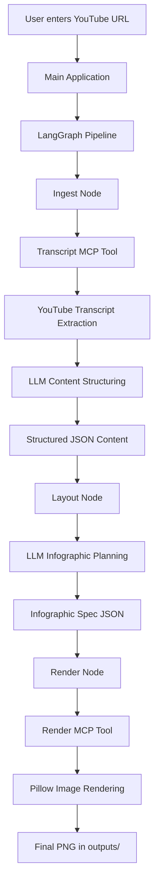

# YouTube Video to Infographics

Convert a YouTube video into a clean infographic using an **LLM + LangGraph + MCP** pipeline.

This project takes a **YouTube URL**, fetches the **video transcript**, transforms the transcript into **structured content**, generates an **infographic specification in JSON**, and renders the final result as a **PNG infographic**.

---

## Overview

The system is designed as a modular pipeline with clearly separated responsibilities:

- **Transcript extraction** from a YouTube video
- **Content structuring** using an LLM
- **Infographic layout generation** in JSON format
- **Image rendering** into a final PNG output

The workflow is orchestrated with **LangGraph**, uses **Azure OpenAI** for reasoning and transformation, and relies on **MCP-based tools** for transcript retrieval and infographic rendering.

---

## Workflow



---

## How It Works

### 1. Transcript Extraction
The user provides a YouTube video URL.  
The system extracts the video ID and fetches the transcript using `youtube-transcript-api`.

### 2. Content Structuring
The raw transcript is passed to an Azure OpenAI model, which converts it into structured JSON suitable for infographic generation.

The structured JSON includes:
- a title
- multiple content sections
- content types such as:
  - `bullets`
  - `steps`
  - `numbers`
  - `text`

### 3. Layout Planning
The structured content is sent to the LLM again, which converts it into an infographic layout specification.

This infographic spec defines:
- canvas size
- layout type
- color palette
- content blocks

### 4. Rendering
The infographic spec is passed to a render tool, which uses **Pillow (PIL)** to generate the final infographic as a PNG image.

### 5. Output
The rendered infographic is saved inside the `outputs/` directory.

---

## Architecture

This project follows a modular architecture:

- **LangGraph**  
  Controls the execution flow between pipeline stages.

- **Azure OpenAI**  
  Handles transcript summarization, structuring, and infographic spec generation.

- **MCP Tool Layer**  
  Encapsulates transcript fetching and infographic rendering as reusable tools.

- **Pillow (PIL)**  
  Converts the final infographic specification into an image.

---

## Core Pipeline

The LangGraph workflow is built with three nodes:

### `ingest`
- Fetches transcript from the transcript tool
- Sends transcript to the LLM
- Produces structured content JSON

### `layout`
- Takes structured content
- Generates infographic layout JSON

### `render`
- Sends infographic spec to render tool
- Produces final PNG file path

---

## Project Structure

```text
utube-Infographics/
│
├── outputs/                        # Generated infographic images
├── src/
│   └── utube_to_infographics/
│       ├── graph.py                # LangGraph workflow
│       ├── llm.py                  # Azure OpenAI configuration
│       ├── main.py                 # Main entry point
│       └── mcp_client.py           # MCP client wrapper
│
├── transcript_server.py            # Transcript MCP tool (STDIO)
├── transcript_serversse.py         # Transcript server variant
├── render_server.py                # Render MCP tool (STDIO)
├── render_serversse.py             # Render server variant
├── poetry.toml                     # Project config and dependencies
└── README.md
```

---

## Tech Stack

- **Python 3.12+**
- **LangGraph**
- **LangChain**
- **Azure OpenAI**
- **MCP**
- **youtube-transcript-api**
- **Pillow (PIL)**
- **Poetry**

---

## Features

- Converts a YouTube video into a visual infographic
- Automatic transcript retrieval from YouTube
- LLM-based content summarization and structuring
- JSON-driven infographic specification
- Automated PNG rendering
- Modular architecture for easy extension
- Clean separation between ingestion, planning, and rendering

---

## Input and Output

### Input
A YouTube video URL, for example:

```text
https://www.youtube.com/watch?v=VIDEO_ID
```

### Output
A generated PNG file saved in:

```text
outputs/infographic_xxxxxxxx.png
```

---

## Environment Variables

Create a `.env` file in the project root and add your Azure OpenAI configuration:

```env
AZURE_OPENAI_API_KEY=your_api_key
AZURE_OPENAI_API_VERSION=your_api_version
AZURE_OPENAI_ENDPOINT=your_azure_endpoint
AZURE_OPENAI_DEPLOYMENT=your_deployment_name
```

If you use deployment defaults as JSON, you can also provide:

```env
AZURE_DEPLOYMENT_DEFAULTS={"deployment_names":{"gpt-4.1":"your_deployment_name"}}
```

---

## Installation

### 1. Clone the repository

```bash
git clone https://github.com/shivanimadhavan/Utube_video_to_infographics.git
cd Utube_video_to_infographics/Desktop/utube-Infographics
```

### 2. Install dependencies

Using Poetry:

```bash
poetry install
```

### 3. Activate the virtual environment

```bash
python -m venv env
.\env\Scripts\activate
```

---

## Run the Project

Run the application from the project root:

```bash
py main.py
```

Then enter a YouTube URL when prompted.

---

## Example Execution Flow

```text
Enter YouTube URL:
https://www.youtube.com/watch?v=example

[1/3] Fetching transcript...
[2/3] Structuring content with LLM...
[3/3] Planning infographic layout...
Rendering infographic...

Infographic created at:
outputs/infographic_ab12cd34.png
```

---

## Design Notes

- The system uses a **JSON-first workflow**, which keeps each stage structured and easy to debug.
- Transcript processing and infographic rendering are separated as **tool-based components**.
- The architecture is reusable for other transcript-to-visual-content applications.
- The rendering layer is deterministic, while the LLM layer handles content understanding and layout reasoning.

---

## Why This Project Matters

This project demonstrates how LLMs can be combined with workflow orchestration and tool-based execution to transform unstructured multimedia content into structured visual knowledge.

It is a good example of:
- multi-step AI pipelines
- LLM orchestration
- tool-based agent systems
- practical content automation
- transcript-to-visual transformation

---

## Future Improvements

- Support multi-page infographic generation
- Add theme/style selection
- Improve layout intelligence for dense transcripts
- Support icons and charts in the renderer
- Add Streamlit or web UI for easier interaction
- Export to PDF or presentation format

---

## Author

**Shivani Madhavan**

---
